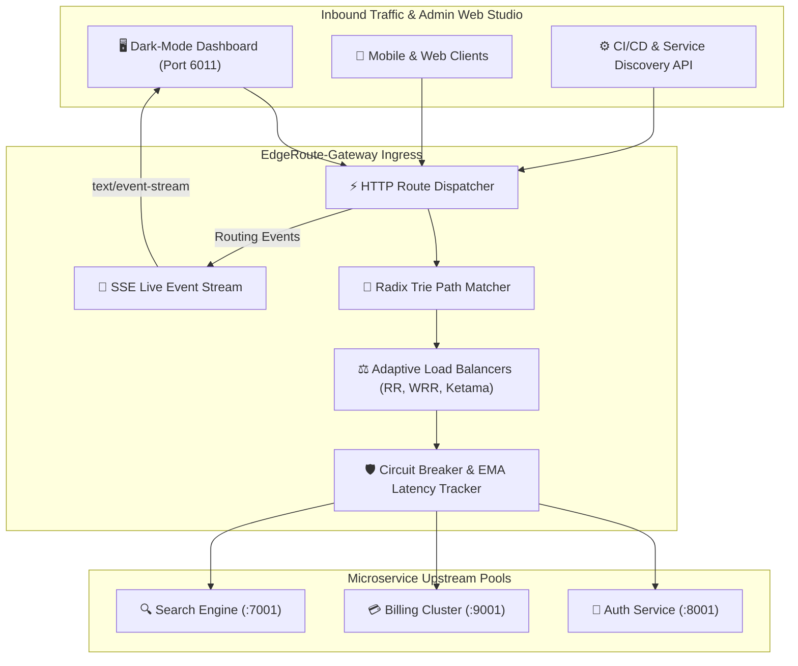

# ⚡ EdgeRoute-Gateway
> **High-Performance Layer 7 Reverse Proxy, Radix Trie Routing Engine & Adaptive Load Balancer**  
> *Developed autonomously by the 7-Agent SDLC Software Factory for [Ali Nurettin Demir](https://github.com/alinurettin)*

[]()
[-success.svg)]()
[]()
[]()
[](https://opensource.org/licenses/MIT)

---

## 🌟 Executive Summary & Value Proposition
As microservice deployments scale, routing client requests efficiently without adding latency or operational complexity is critical. Traditional enterprise ingress controllers add significant memory footprints and complex declarative configurations.

**EdgeRoute-Gateway** is a lightweight, zero-dependency reverse proxy, API gateway, and adaptive load balancer written from first principles in pure Node.js. It features $O(K)$ Radix Trie path resolution, parameter extraction (`:userId`), prefix stripping, Smooth Weighted Round-Robin (Nginx algorithm), Ketama consistent hashing with virtual nodes, and active circuit breaking.

---

## 🏗️ System Architecture & Data Flow



---

## 🔬 Mathematical & Algorithmic Foundation

### 1. Radix Trie Path Resolution ($O(K)$)
Paths are parsed into slash-separated tokens and traversed down a compressed prefix tree. Rather than evaluating $N$ regular expressions linearly, path lookup time is bounded by path segment depth $K$ ($O(K)$ where $K \le 8$).

### 2. Smooth Weighted Round-Robin (Nginx Algorithm)
Maintains current dynamic weights $c_i$ initialized to zero. For each request:
$$c_i \leftarrow c_i + w_i \quad \forall i$$
$$k = \arg\max_{i} c_i$$
$$c_k \leftarrow c_k - \sum w_i$$
This algorithm guarantees smooth temporal distribution of load without burst clustering.

### 3. Ketama Consistent Hashing
Virtual nodes are mapped along a 32-bit continuum $[0, 2^{32}-1]$. Binary search maps incoming client IP hashes to the nearest upstream in $O(\log(M \cdot V))$ time, preserving cache stickiness upon upstream changes.

---

## 🔌 API Specification & REST Endpoints

| Method | Endpoint | Description |
|---|---|---|
| `GET` | `/api/health` | Health status and uptime |
| `GET` | `/api/stats` | Gateway metrics, active routes, and healthy upstreams |
| `GET` | `/api/routes` | List registered gateway route policies |
| `POST` | `/api/routes` | Register new dynamic route policy |
| `GET` | `/api/upstreams` | List configured upstreams with telemetry metrics |
| `POST` | `/api/upstreams` | Add new upstream node to cluster pool |
| `PUT` | `/api/upstreams/:id/health` | Manually toggle node health status |
| `POST` | `/api/gateway/resolve` | Simulate request resolution and load balancing dispatch |
| `GET` | `/api/events/stream` | Server-Sent Events (SSE) live broadcast stream |

### Route Resolution Example
```bash
curl -X POST http://localhost:6011/api/gateway/resolve \
  -H "Content-Type: application/json" \
  -d '{
    "path": "/api/v1/payments/inv_94821",
    "clientKey": "192.168.1.100"
  }'
```

---

## 🧪 Comprehensive Automated Testing & Verification
The test suite in `tests/run_tests.js` runs without external mocking libraries:

```bash
node tests/run_tests.js
```

### Verified Test Categories:
- **Radix Trie Router (4 assertions):** Exact matches, multi-variable parameter extraction, wildcard globbing, and mismatch rejection.
- **Load Balancing Strategies (3 assertions):** Round-robin alternation, smooth weighted round-robin distribution, and Ketama sticky hashing.
- **Circuit Breaking & Health (3 assertions):** Three-failure trip to `UNHEALTHY`, two-success recovery to `HEALTHY`, and automatic pool bypassing.
- **Request Header & Path Enrichment (1 assertion):** Prefix stripping and proxy header injection.
- **Live Ephemeral HTTP Gateway (10 assertions):** Ephemeral port 0 REST and SSE integration.

---

## 🚀 Getting Started

### Local Node.js Execution
```bash
# 1. Clone repository
git clone https://github.com/alinurettin/EdgeRoute-Gateway.git
cd EdgeRoute-Gateway

# 2. Run automated test suite
npm test

# 3. Start engine
npm start
```
Open **`http://localhost:6011`** in your browser to access the live dashboard.

### Docker & Docker Compose
```bash
docker-compose up -d --build
```

---

## 📄 Artifacts & Documentation
- [Research Report](file:///C:/Users/alinurettin/.gemini/antigravity/scratch/projects/EdgeRoute-Gateway/artifacts/RESEARCH_REPORT.md)
- [Product Requirements Document (PRD)](file:///C:/Users/alinurettin/.gemini/antigravity/scratch/projects/EdgeRoute-Gateway/artifacts/PRD.md)
- [Architecture Blueprint](file:///C:/Users/alinurettin/.gemini/antigravity/scratch/projects/EdgeRoute-Gateway/artifacts/ARCHITECTURE.md)
- [QA & Verification Report](file:///C:/Users/alinurettin/.gemini/antigravity/scratch/projects/EdgeRoute-Gateway/artifacts/QA_REPORT.md)
- [Release Notes](file:///C:/Users/alinurettin/.gemini/antigravity/scratch/projects/EdgeRoute-Gateway/artifacts/RELEASE_NOTES.md)

---

## 📜 License
MIT License. Engineered autonomously by the 7-Agent SDLC Software Factory for Ali Nurettin Demir.
