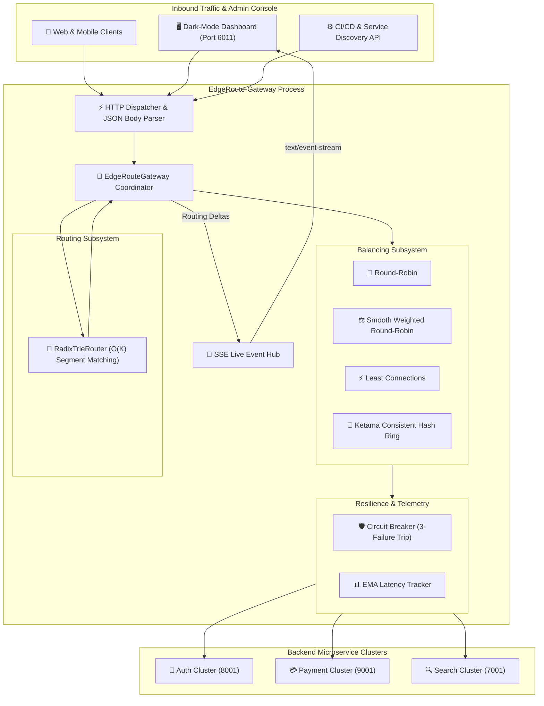

# 🏛️ Technical Architecture Document: EdgeRoute-Gateway
**Version:** 2.0.0  
**Domain:** Layer 7 Ingress Gateway & Load Balancer  
**Architect:** 7-Agent SDLC Principal Software Architect  

---

## 1. System Topology & Architecture

---

## 2. Core Architectural Subsystems

### 2.1 `RadixTrieRouter` (`src/engine.js`)
- Decomposes URLs into slash-separated tokens.
- Parameterized nodes (`:param`) dynamically populate request parameter dictionaries.
- Wildcard nodes (`*path`) absorb remaining URL paths for proxy passthrough.

### 2.2 Adaptive Load Balancers (`src/engine.js`)
- **`ROUND_ROBIN`**: Increments atomic route counter mod healthy upstreams count.
- **`WEIGHTED_ROUND_ROBIN`**: Smooth Nginx algorithm distributing traffic evenly over time according to configured weight capacities.
- **`CONSISTENT_HASH`**: Ketama 32-bit ring mapping clients to virtual nodes for persistent caching and session stickiness.

### 2.3 Circuit Breaker & Health Probing (`src/engine.js`)
- Each `UpstreamNode` maintains failure counters and exponential moving average (EMA) latencies.
- Three consecutive errors automatically quarantine an upstream, protecting clients from cascading timeouts.

### 2.4 Path Rewriting & Header Enrichment (`src/engine.js`)
- Automatically strips defined prefixes (e.g. `/api/v1`) before forwarding.
- Injects standard proxy headers (`X-Request-ID`, `X-Forwarded-For`, `X-Forwarded-Proto`).
